

# SE-Assignment-5
Installation and Navigation of Visual Studio Code (VS Code)
 Instructions:
Answer the following questions based on your understanding of the installation and navigation of Visual Studio Code (VS Code). Provide detailed explanations and examples where appropriate.

 Questions:

1. Installation of VS Code:
   - Describe the steps to download and install Visual Studio Code on Windows 11 operating system. Include any prerequisites that might be needed.
   Steps to Download and Install VS Code on Windows

Download VS Code:

Visit the official website of Visual Studio Code: Visual Studio Code Download.
Look for the “Download for Windows” button and click on it.
This will start the download of the VS Code installer (VSCodeUserSetup-x64-1.X64-1.XX.X.exe).
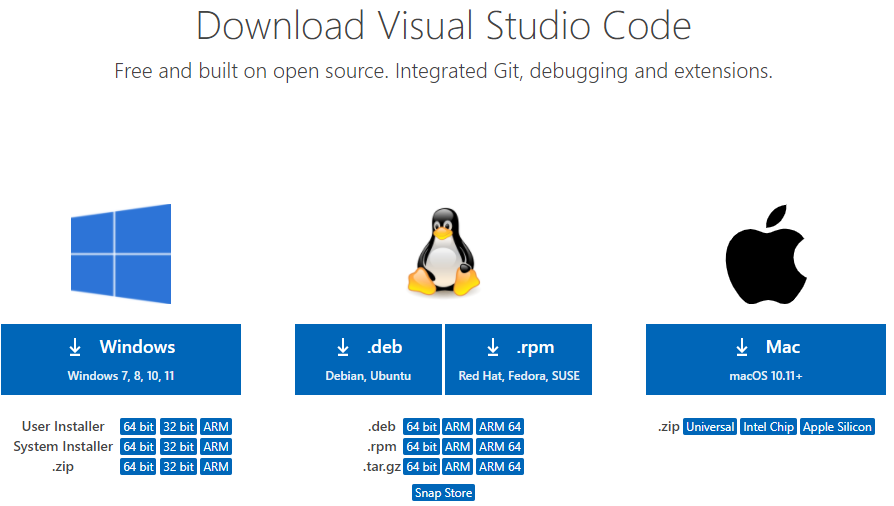

Run the Installer:

Once the download is complete, locate it in the file explorer.
Double-click on the installer file.
The installer wizard will appear.
Installation Prompt:

Accept the license agreement and click next.
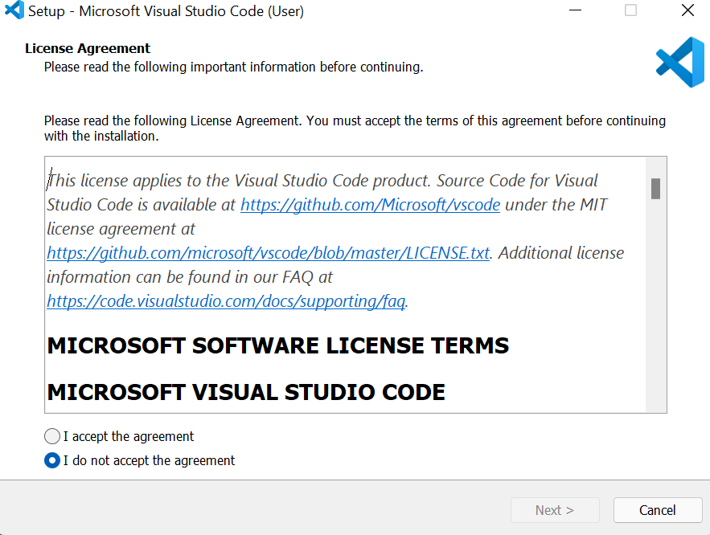

Choose the location where you want the VS Code installation to be kept. Accept the default location and click next.

Accept the default Start Menu Folder and click Next.
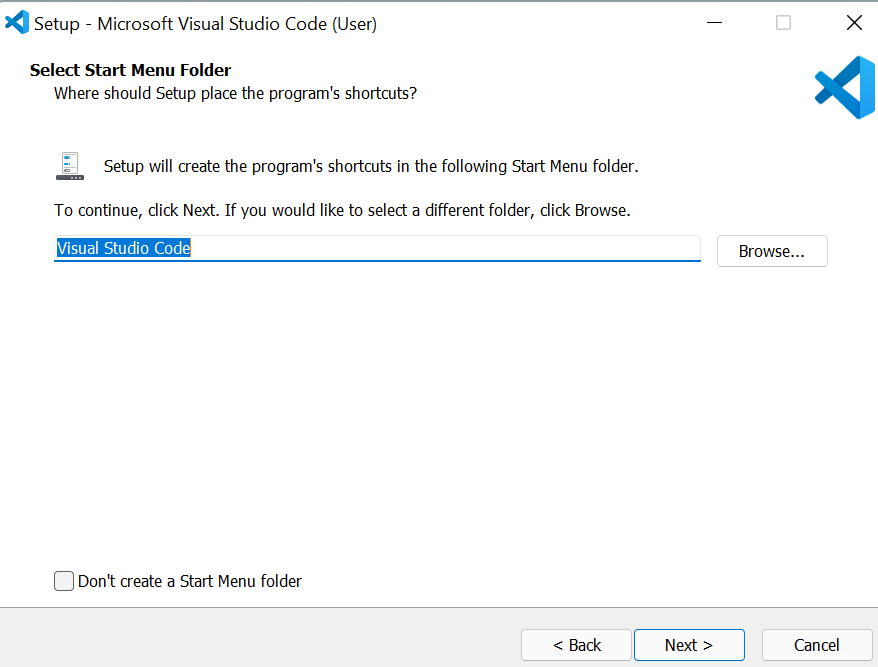

Select additional tasks (optional but recommended):
Click on Create a Desktop icon.
Click on Add to path (important to use the command line).
Click register code as an Editor for supported files.
Adding “Open with Code” action to the Windows Explorer context menu.
Adding “Open with Code” to the directory context menu.
Click next.
The installation will begin. Click on the install button.
After clicking install, it should take about one minute to install VS Code on your device.

Finish Installation:

After installation, a setup window will appear. Tick on Launch VS Code and click Finish.

prerequisites - Windows 10 or 11 (64-bit). - Internet connection to download the installer. - 1.6 GHz or faster processor. - 1 GB RAM.

2. First-time Setup:
   - After installing VS Code, what initial configurations and settings should be adjusted for an optimal coding environment? Mention any important settings or extensions.
   After installing VS Code, what initial configurations and settings should be adjusted for an optimal coding environment? Mention any important settings or extensions.
Initial Configurations and Settings for Optimal Coding Environment

Theme Selection:

Go to File > Preferences > Color Theme and choose a theme that suits your preferences (e.g., Dark+, Light+).
Install an icon pack like "Material Icon Theme" for better file navigation.
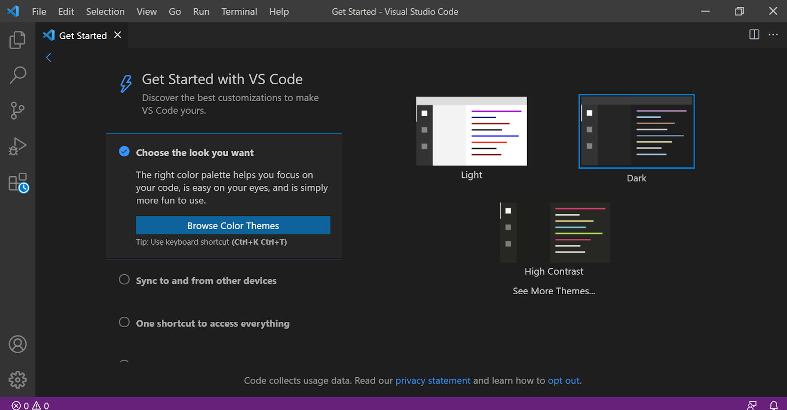

Font Selection:

Open File > Preferences > Settings.
In the search bar, type "Font Size" and adjust it (e.g., 14).
Type "Font Family" to change the font (e.g., Fira Code, Consolas).
Extensions:

Install essential extensions by clicking the Extensions icon in the Activity Bar.

Common extensions include:

Prettier (Code formatter).
ESLint (JavaScript and TypeScript linting).
Live Server (Local server for HTML/JavaScript development).
Python (Python language support).

Editor Configuration:

Adjust editor settings like tab size, auto-save, and word wrap via File > Preferences > Settings.
Access settings via File > Preferences > Settings or Ctrl+,.
Version Control Setup:

If using Git, ensure it is installed and configure VS Code to use Git:
File > Preferences > Settings, search for "Git Path" and set the path if needed.
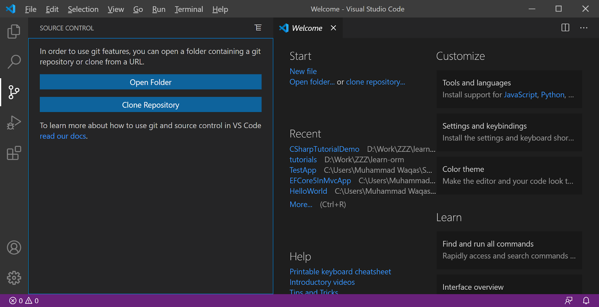

3. User Interface Overview:

   - Explain the main components of the VS Code user interface. Identify and describe the purpose of the Activity Bar, Side Bar, Editor Group, and Status Bar.
   Explain the main components of the VS Code user interface. Identify and describe the purpose of the Activity Bar, Side Bar, Editor Group, and Status Bar.
Main Components of the VS Code User Interface

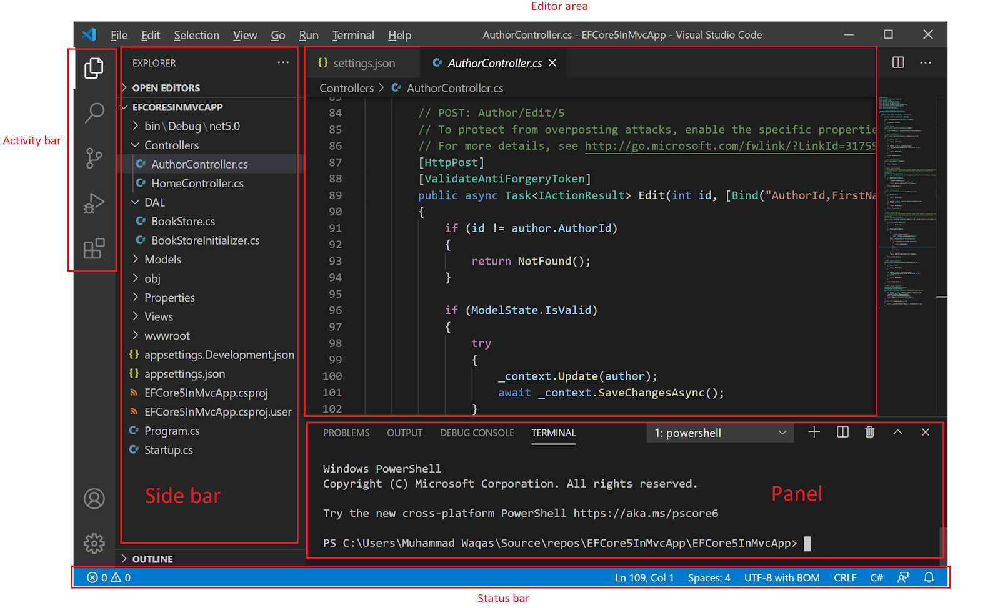

Activity Bar: - Located on the far left, it provides access to different views like Explorer, Search, Source Control, Run and Debug, and Extensions.

Side Bar: - Displays different panels based on the selected activity (e.g., file explorer, search results, source control changes).

Editor Area: - The main area where files are opened and edited. You can have multiple editor groups to view files side-by-side.

Status Bar: - Located at the bottom, it shows information about the current file and project, such as line number, Git branch, errors and warnings, and programming language.

4. Command Palette:
   - What is the Command Palette in VS Code, and how can it be accessed? Provide examples of common tasks that can be performed using the Command Palette.
   What is the Command Palette in VS Code, and how can it be accessed? Provide examples of common tasks that can be performed using the Command Palette.

What is the Command Palette? The Command Palette is a powerful tool in VS Code that allows you to access and execute various commands quickly.

Accessing the Command Palette - Press Ctrl + Shift + P (or F1).

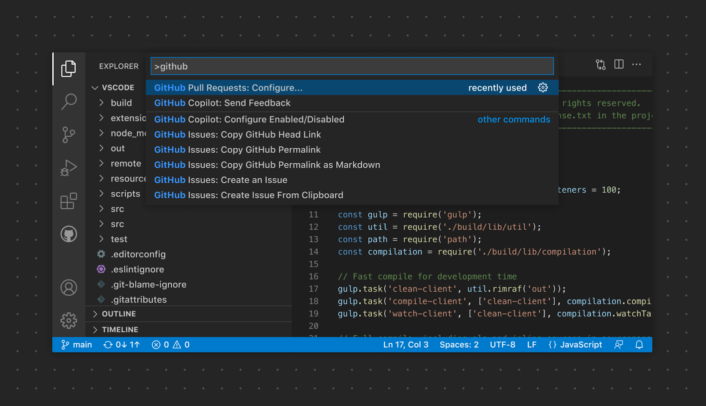

Common Tasks Using the Command Palette

Opening files: File: Open File....
Installing extensions: Extensions: Install Extensions.
Running tasks: Tasks: Run Task.
Formatting code: Format Document.
Changing color theme: Preferences: Color Theme.

5. Extensions in VS Code:
   - Discuss the role of extensions in VS Code. How can users find, install, and manage extensions? Provide examples of essential extensions for web development.
Discuss the role of extensions in VS Code. How can users find, install, and manage extensions? Provide examples of essential extensions for web development.

Role of Extensions Extensions enhance the functionality of VS Code by adding support for new languages, themes, debuggers, and tools.

Finding, Installing, and Managing Extensions

Finding Extensions:
Click on the Extensions icon in the Activity Bar.or Click the Extensions icon in the Activity Bar or press Ctrl + Shift + X.
Search for the desired extension and click "Install".
Installing Extensions:
Search for the desired extension in the Extensions view.
Click the "Install" button next to the extension.
Managing Extensions:
View installed extensions in the Extensions view.
Disable or uninstall extensions by clicking the gear icon next to each extension.
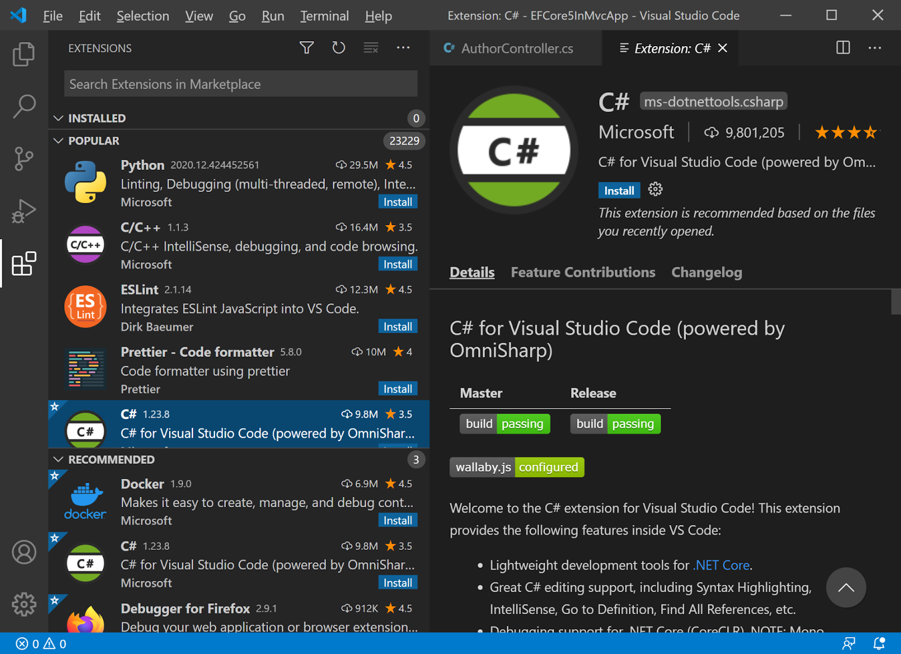

Essential Extensions for Web Development

Prettier: Code formatter.
ESLint: JavaScript and TypeScript linting.
Live Server: Local server for HTML/JavaScript development.
Debugger for Chrome: Debugging JavaScript code in Chrome.
HTML Snippets: Code snippets for HTML.

6. Integrated Terminal:
   - Describe how to open and use the integrated terminal in VS Code. What are the advantages of using the integrated terminal compared to an external terminal?

Describe how to open and use the integrated terminal in VS Code. What are the advantages of using the integrated terminal compared to an external terminal?
Opening and Using the Integrated Terminal

Opening the Terminal:
To open the integrated terminal, go to View > Terminal or press Ctrl+ (backtick).
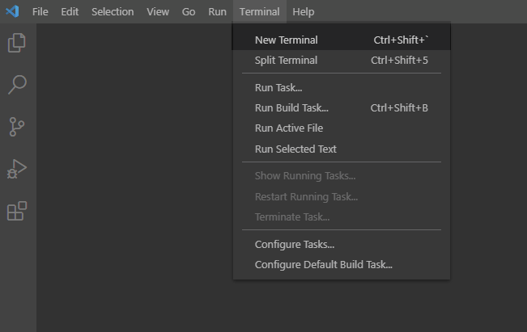

Using the Terminal:
Execute commands as you would in any terminal.
Create multiple terminals and switch between them.
Advantages of Using the Integrated Terminal

Directly interacts with the project files.
Supports multiple terminal sessions.
Consistent environment within the editor.
Integrated with VS Code features (e.g., debugging, source control).

7. File and Folder Management:
   - Explain how to create, open, and manage files and folders in VS Code. How can users navigate between different files and directories efficiently?

   Explain how to create, open, and manage files and folders in VS Code. How can users navigate between different files and directories efficiently?
Creating, Opening, and Managing Files and Folders
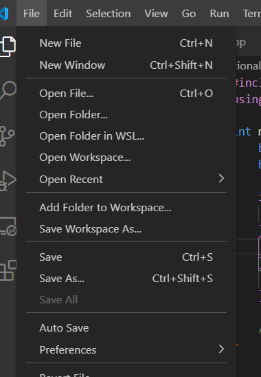

Creating Files/Folders:
Right-click in the Explorer view and select "New File" or "New Folder."
Or use the Command Palette (Ctrl+Shift+P) and type New File or New Folder.
Opening Files:
Double-click a file in the Explorer view to open it in the Editor.
Use the File > Open File or File > Open Folder menu options.
Managing Files:
Use the context menu in the Explorer view to rename, delete, or move files and folders.
Navigating Between Files and Directories Efficiently

Use the Explorer view to browse directories.
Use Ctrl + P to quickly open a file by name.
Use the breadcrumbs feature at the top of the editor to navigate the file structure.
Use Ctrl + Tab to switch between open files.

8. Settings and Preferences:
   - Where can users find and customize settings in VS Code? Provide examples of how to change the theme, font size, and keybindings.

   Where can users find and customize settings in VS Code? Provide examples of how to change the theme, font size, and keybindings.

Finding and Customizing Settings
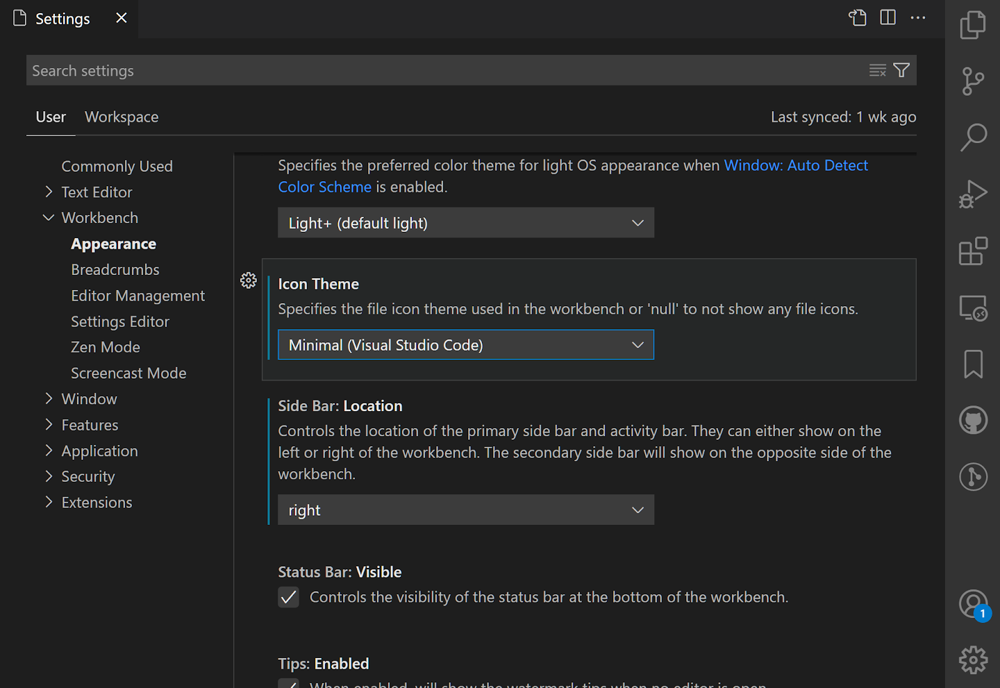

Accessing Settings:
Go to File > Preferences > Settings (or press Ctrl+,).
Changing Theme:
Search for "Color Theme" in the search bar and select the preferred theme.
Adjusting Font Size:
Search for "Font Size" in the search bar and adjust the font size.
Modifying Keybindings:
Search for "Keybindings" in the search bar and modify the keybindings.
Go to File > Preferences > Keyboard Shortcuts or press Ctrl + K Ctrl + S.

9. Debugging in VS Code:
   - Outline the steps to set up and start debugging a simple program in VS Code. What are some key debugging features available in VS Code?
   Outline the steps to set up and start debugging a simple program in VS Code. What are some key debugging features available in VS Code?
Setting Up and Starting Debugging

Open the Debug View:

Click on the Debug icon in the Activity Bar or press Ctrl+Shift+D.
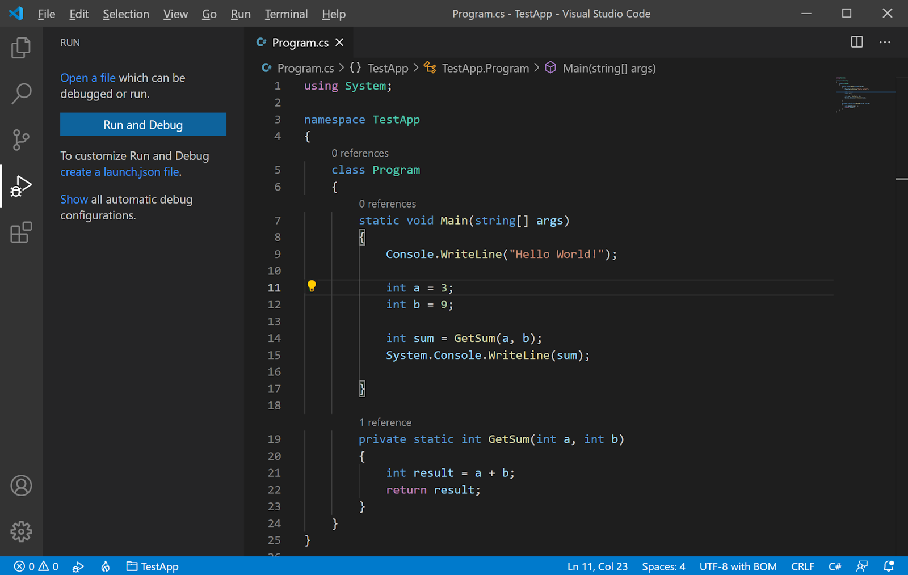

Configure Debugging:

Click on the gear icon to create a launch.json file with debugging configurations.
set Breakpoints:

Click in the gutter next to the line number where you want to add a breakpoint.
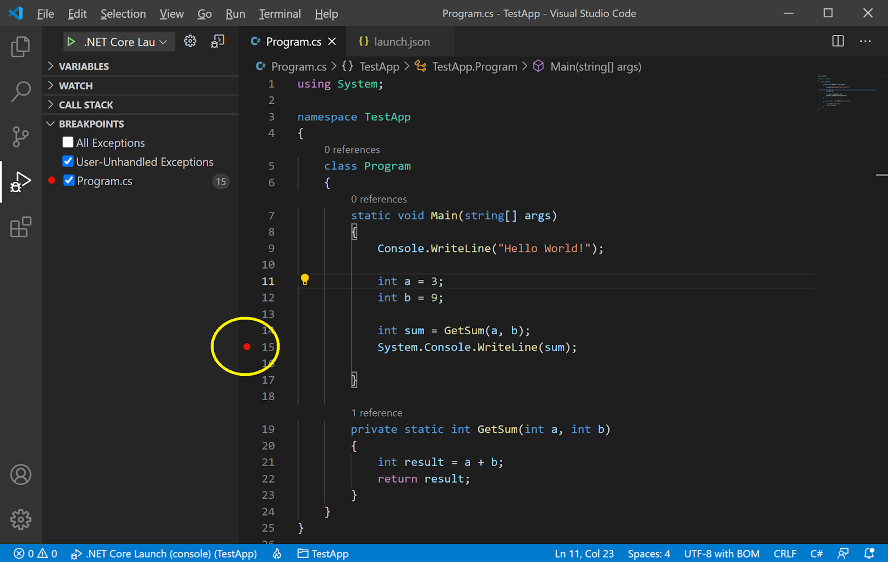

Start Debugging:
Click on the Start Debugging button to start debugging.0r press F5
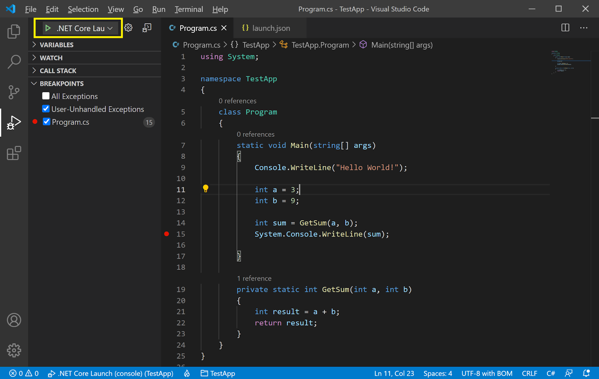

Key Debugging Features
Breakpoints: Pause execution at specific lines.
Watch: Monitor variables and expressions.
Call Stack: View the call stack and navigate through function calls.
Variables: Inspect the current state of variables.
Debug Console: Execute commands and evaluate expressions during debugging.

10. Using Source Control:
    - How can users integrate Git with VS Code for version control? Describe the process of initializing a repository, making commits, and pushing changes to GitHub.
    How can users integrate Git with VS Code for version control? Describe the process of initializing a repository, making commits, and pushing changes to GitHub.

Integrating Git with VS Code

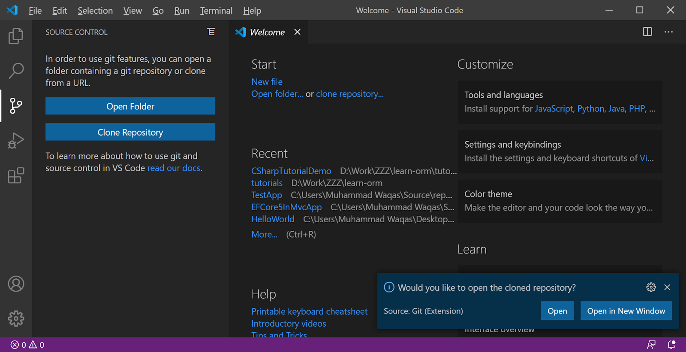

Initializing a Repository:

Click on the Source Control icon in the Activity Bar or press Ctrl + Shift + X.
Click "Initialize Repository" to create a new Git repository.
Alternatively Open the terminal and run git init in your project directory.
Making Commits:

Click on the Source Control icon in the Activity Bar or press Ctrl + Shift + X.
Click "Commit Changes".
Alternatively, open the terminal and run git commit -m "commit message" in your project directory.
Pushing Changes to GitHub:
Click on the Source Control icon in the Activity Bar or press Ctrl + Shift + X.
Click "Push Changes".
Alternatively, open the terminal and run git push in your project directory.
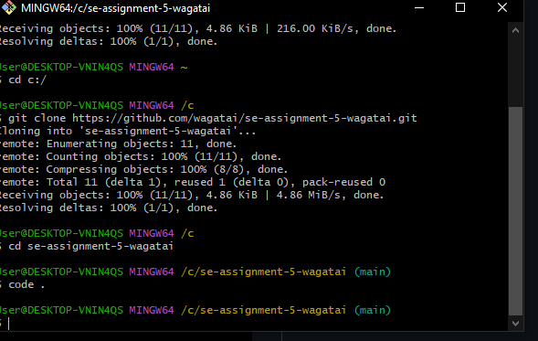

 Submission Guidelines:
- Your answers should be well-structured, concise, and to the point.
- Provide screenshots or step-by-step instructions where applicable.
- Cite any references or sources you use in your answers.
- Submit your completed assignment by 1st July 

